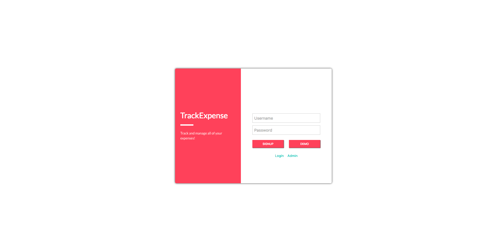
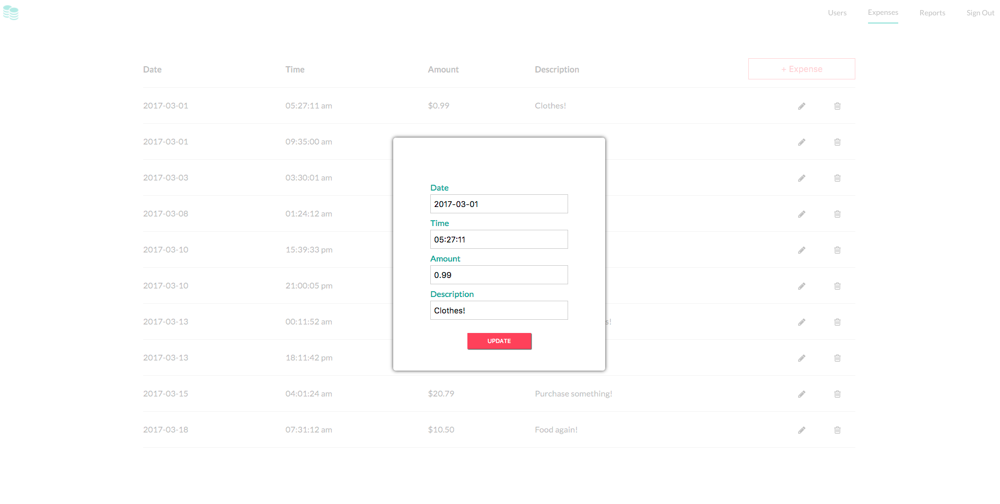
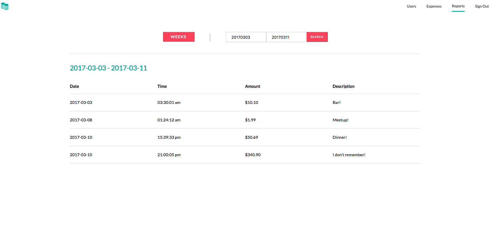

# TrackExpense

Better understand your spending patterns by inputing expenses and generating reports!

[TrackExpense][live]

[live]: http://www.trackexpense.raymondlee.io/








## Unit / Integration Tests (Specs)

```
bundle exec rspec spec/models/user_spec.rb
bundle exec rspec spec/models/expense_spec.rb
bundle exec rspec spec/controllers/application_controller_spec.rb
bundle exec rspec spec/controllers/users_controller_spec.rb
bundle exec rspec spec/controllers/sessions_controller_spec.rb
bundle exec rspec spec/controllers/expenses_controller_spec.rb

--------------------------------------------------------------------

Run `npm test` to run all specs at once.

Entry point test:

1. `frontend/__tests__/track_expense-test.js`

Redux tests:

1. `frontend/__tests__/expenses_api_util-test.js`
2. `frontend/__tests__/expenses_actions-test.js`
3. `frontend/__tests__/reducers-test.js`
4. `frontend/__tests__/store-test.js`

Component tests:

1. `frontend/__tests__/post_index-test.js`
  * Write `PostIndexContainer` before `PostIndex`
2. `frontend/__tests__/post_index_item-test.js`
3. `frontend/__tests__/post_form-test.js`
  * Write `PostFormContainer` before `PostForm`
4. `frontend/__tests__/post_show-test.js`
```
